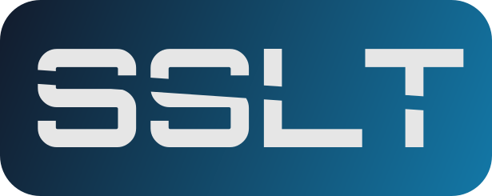

[![Contributors][contributors-shield]][contributors-url]
[![Forks][forks-shield]][forks-url]
[![Stargazers][stars-shield]][stars-url]
[![Issues][issues-shield]][issues-url]
[![MIT License][license-shield]][license-url]
[![LinkedIn][linkedin-shield]][linkedin-url]

<!-- PROJECT LOGO -->
 

  

<h3 align="center">Steam Shared Library Tweaks</h3>

  

    Easy script to disable Steam kicking you out of your game when your friend starts playing.
     
    <a href="https://github.com/github_username/repo_name/issues">Report Bug</a>
    ·
    <a href="https://github.com/github_username/repo_name/issues">Request Feature</a>
  

<!-- TABLE OF CONTENTS -->

  
Table of Contents

  <ol>
    <li>
      <a href="#about-the-project">About The Project</a>
    </li>
    <li>
      <a href="#disclaimer">DISCLAIMER</a>
    </li>
    <li>
      <a href="#getting-started">Getting Started</a>
      <ul>
        <li><a href="#installation">Installation</a></li>
      </ul>
    </li>
    <li><a href="#usage">Usage</a></li>
    <li><a href="#contributing">Contributing</a></li>
    <li><a href="#license">License</a></li>
    <li><a href="#contact">Contact</a></li>
  </ol>

<!-- ABOUT THE PROJECT -->

## About The Project

Have you ever played a game that your friend shared with you via Steam Family Sharing, just to be never able to play because every time you do, he starts playing something too, and Steam kick you out? **YEAH! I HAD!** That's what this project is about to fix.

(<a href="#top">back to top</a>)

## DISCLAIMER

❗THIS SCRIPT WILL MODIFY YOUR FIREWALL TO DISABLE STEAM CHECKING IF THE OWNER IS ONLINE. IF YOU TERMINATE THE SCRIPT BEFORE THE END, YOU WILL NEED TO RUN IT AGAIN TO DISABLE THE FIREWALL RULES (or just do it yourself).❗

(<a href="#top">back to top</a>)

<!-- GETTING STARTED -->

## Getting Started

### Installation

Download the latest version from releases page: [https://github.com/Stax124/SteamSharedLibraryTweaks/releases](https://github.com/Stax124/SteamSharedLibraryTweaks/releases)

(<a href="#top">back to top</a>)

<!-- USAGE EXAMPLES -->

## Usage

- Open your terminal of choice with administrator privileges (Windows Terminal, PowerShell, etc.)
- Navigate to the folder where the script is located. Example: `cd C:\Users\username\Downloads`
- Run the script: `.\steam_shared_lib_tweaks.exe`

(<a href="#top">back to top</a>)

<!-- CONTRIBUTING -->

## Contributing

Contributions are what make the open source community such an amazing place to learn, inspire, and create. Any contributions you make are **greatly appreciated**.

If you have a suggestion that would make this better, please fork the repo and create a pull request. You can also simply open an issue with the tag "enhancement".
Don't forget to give the project a star! Thanks again!

1. Fork the Project
2. Create your Feature Branch (`git checkout -b feature/AmazingFeature`)
3. Commit your Changes (`git commit -m 'Add some AmazingFeature'`)
4. Push to the Branch (`git push origin feature/AmazingFeature`)
5. Open a Pull Request

(<a href="#top">back to top</a>)

<!-- LICENSE -->

## License

Distributed under the MIT License. See `LICENSE` for more information.

(<a href="#top">back to top</a>)

<!-- CONTACT -->

## Contact

Tomáš Novák - tamoncz@gmail.com

Project Link: [https://github.com/Stax124/SteamSharedLibraryTweaks](https://github.com/Stax124/SteamSharedLibraryTweaks)

(<a href="#top">back to top</a>)

[contributors-shield]: https://img.shields.io/github/contributors/Stax124/SteamSharedLibraryTweaks.svg?style=for-the-badge
[contributors-url]: https://github.com/Stax124/SteamSharedLibraryTweaks/graphs/contributors
[forks-shield]: https://img.shields.io/github/forks/Stax124/SteamSharedLibraryTweaks.svg?style=for-the-badge
[forks-url]: https://github.com/Stax124/SteamSharedLibraryTweaks/network/members
[stars-shield]: https://img.shields.io/github/stars/Stax124/SteamSharedLibraryTweaks.svg?style=for-the-badge
[stars-url]: https://github.com/Stax124/SteamSharedLibraryTweaks/stargazers
[issues-shield]: https://img.shields.io/github/issues/Stax124/SteamSharedLibraryTweaks.svg?style=for-the-badge
[issues-url]: https://github.com/Stax124/SteamSharedLibraryTweaks/issues
[license-shield]: https://img.shields.io/github/license/Stax124/SteamSharedLibraryTweaks.svg?style=for-the-badge
[license-url]: https://github.com/Stax124/SteamSharedLibraryTweaks/blob/master/LICENSE
[linkedin-shield]: https://img.shields.io/badge/-LinkedIn-black.svg?style=for-the-badge&logo=linkedin&colorB=555
[linkedin-url]: https://www.linkedin.com/in/tom%C3%A1%C5%A1-nov%C3%A1k-5a163321b/
